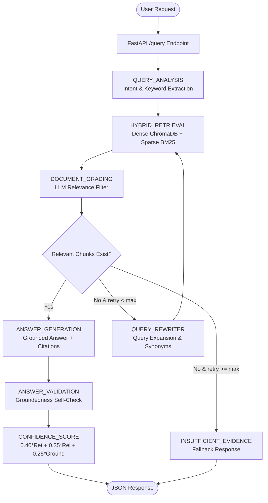

# 🧠 DocuMind: A Self-Correcting Technical Documentation Assistant

[](https://express-analytics-hfsuhuvs8vwlutwm8rczjs.streamlit.app/)

> 🌐 **Live Web Application Demo**: [https://express-analytics-hfsuhuvs8vwlutwm8rczjs.streamlit.app/](https://express-analytics-hfsuhuvs8vwlutwm8rczjs.streamlit.app/)  
> 📂 **GitHub Repository**: [https://github.com/Suhirdha24/express-analytics](https://github.com/Suhirdha24/express-analytics)

DocuMind is an enterprise-ready, production-grade Retrieval-Augmented Generation (RAG) system built with **LangGraph**, **LangChain**, **FastAPI**, **ChromaDB**, **Rank-BM25**, and **Google Gemini** (or configurable LLM providers).

Unlike standard RAG pipelines (Question → Retrieve → Answer) which silently fail when retrieval quality is low or hallucinate unsupported answers, DocuMind implements a **self-correcting agentic workflow** that evaluates document relevance, rewrites low-recall queries, validates groundedness, calculates an explicit confidence score, and provides graceful fallback responses when evidence is insufficient.

---

## 1. Project Overview
DocuMind acts as an intelligent AI assistant trained on technical documentation. It provides accurate, citation-backed answers grounded strictly in indexed technical docs. 

Key capabilities:
- **Hybrid Retrieval**: Dense vector search (ChromaDB + `sentence-transformers`) merged with sparse keyword search (BM25) using Reciprocal Rank Fusion (RRF).
- **Self-Correcting Graph**: Autonomous LangGraph loop that grades document relevance and rewrites search queries upon low recall.
- **Fact Checking & Validation**: Inspects generated responses against retrieved context to prevent hallucinations.
- **Deterministic Confidence Metric**: Composite score combining retrieval quality, relevance, and groundedness.
- **REST API & Interactive Dashboard**: Built with FastAPI and Streamlit.

---

## 2. Problem Statement
Standard naive RAG architectures suffer from three critical flaws:
1. **Retrieval Misses**: Search queries that use different vocabulary than the documentation fail to retrieve relevant chunks, producing generic or hallucinated answers.
2. **Irrelevant Noise**: Unfiltered retrieved chunks dilute context windows, introducing noise into the LLM prompt.
3. **Hallucination Risk**: LLMs often generate plausible-sounding answers even when retrieved context lacks supporting evidence.

DocuMind solves these problems by inserting evaluation, self-correction, and validation control loops into the RAG lifecycle.

---

## 3. Why This Architecture Was Chosen
- **LangGraph**: Enables stateful, cyclic RAG graph execution with conditional routing, enabling retry loops that standard linear chains cannot support.
- **Hybrid Dense + Sparse Search**: Dense embeddings capture semantic intent while BM25 keyword matching ensures exact technical term lookup (e.g. function names, HTTP status codes, decorator names).
- **Reciprocal Rank Fusion (RRF)**: Combines dense and sparse rankings without requiring delicate score normalization across different metric spaces.
- **FastAPI + Pydantic**: Provides high-performance, asynchronous endpoints with automated input validation and OpenAPI documentation.

---

## 4. System Architecture Diagram



---

## 5. LangGraph Workflow Explanation

1. **QUERY_ANALYSIS**: Classifies question intent (`conceptual`, `how_to`, `troubleshooting`, `api_reference`), extracts technical terms, detects ambiguity, and formulates an optimized retrieval query.
2. **HYBRID_RETRIEVAL**: Executes dense vector similarity search and sparse BM25 search concurrently, merging results using Reciprocal Rank Fusion (RRF).
3. **DOCUMENT_GRADING**: Evaluates retrieved chunks with an LLM prompt as `relevant`, `partially_relevant`, or `irrelevant`. Filters out irrelevant noise.
4. **CONDITIONAL ROUTER**:
   - If relevant chunks exist $\rightarrow$ proceed to `ANSWER_GENERATION`.
   - If no relevant chunks exist and `retry_count < max_retries` $\rightarrow$ proceed to `QUERY_REWRITER`.
   - If retries exhausted $\rightarrow$ proceed to `INSUFFICIENT_EVIDENCE_RESPONSE`.
5. **QUERY_REWRITER**: Expands the original search query using technical keywords, intent context, and synonyms, then returns to `HYBRID_RETRIEVAL`.
6. **ANSWER_GENERATION**: Generates a technical answer grounded strictly in approved context with inline citations (`[Source: Title – Source]`).
7. **ANSWER_VALIDATION**: Fact-checks claims in the answer against context chunks to compute a groundedness score.
8. **CONFIDENCE_SCORE**: Calculates the composite confidence metric ($0..100\%$).

---

## 6. State Schema Explanation

The application state (`DocuMindState`) is defined as follows:

| Field | Type | Description |
| :--- | :--- | :--- |
| `question` | `str` | Raw original user query. |
| `optimized_query` | `str` | Current search query (rewritten on retries). |
| `query_type` | `str` | Classified intent category. |
| `technical_keywords` | `List[str]` | Extracted domain concepts. |
| `is_ambiguous` | `bool` | Ambiguity indicator. |
| `retrieved_documents` | `List[Dict]` | Raw chunks retrieved by hybrid search. |
| `graded_documents` | `List[Dict]` | All chunks with LLM grading metadata. |
| `relevant_documents` | `List[Dict]` | Filtered chunks approved for generation. |
| `retry_count` | `int` | Number of query rewrite retries executed. |
| `max_retries` | `int` | Maximum retry limit (default: 2). |
| `generated_answer` | `str` | Final generated response or fallback text. |
| `citations` | `List[str]` | Deduplicated inline citations. |
| `retrieval_quality` | `float` | Average retrieval similarity score ($0.0 - 1.0$). |
| `relevance_quality` | `float` | Average document relevance score ($0.0 - 1.0$). |
| `groundedness_score` | `float` | Answer groundedness ratio ($0.0 - 1.0$). |
| `confidence_score` | `float` | Final normalized confidence score ($0 - 100$). |
| `workflow_trace` | `List[str]` | Node execution audit trail. |
| `status` | `str` | `success`, `insufficient_evidence`, or `error`. |

---

## 7. Hybrid Retrieval Explanation
DocuMind combines two complementary retrieval techniques:
1. **Dense Retrieval (ChromaDB)**: Encodes text chunks using `sentence-transformers/all-MiniLM-L6-v2` into 384-dimensional dense vectors to capture semantic meaning.
2. **Sparse Retrieval (Rank-BM25)**: Tokenizes content to perform exact term-frequency keyword matching.
3. **Reciprocal Rank Fusion (RRF)**: Merges the top-$K$ candidates from both systems:
   $$\text{RRF Score}(d) = \sum_{m \in \{\text{vector}, \text{bm25}\}} \frac{1}{60 + r_m(d)}$$
   The merged chunks are deduplicated by SHA256 chunk ID and top-$K$ highest scoring chunks are passed downstream.

---

## 8. Document Grading Logic
Before generation, every chunk undergoes strict evaluation. The LLM classifies chunks into:
- `relevant`: Direct answer or precise technical context.
- `partially_relevant`: Helpful background material.
- `irrelevant`: Off-topic or noise.

Only chunks classified as `relevant` or `partially_relevant` with a score $\ge 0.4$ are retained in `relevant_documents`.

---

## 9. Self-Correction and Retry Logic
When zero relevant chunks remain after grading:
1. The graph checks if `retry_count < max_retries`.
2. If retries remain, the `QUERY_REWRITER` node rephrases the query using synonyms, broader terminology, and technical keywords.
3. `retry_count` increments by $1$.
4. The workflow loops back to `HYBRID_RETRIEVAL` with the expanded query.

---

## 10. Groundedness Validation
To guarantee zero hallucination:
The `ANSWER_VALIDATION` node inspects the generated answer against the approved context chunks. It generates a `groundedness_score` ($0.0 - 1.0$) reflecting the fraction of claims backed by evidence. If unverified claims are discovered, they are logged in `unsupported_claims`.

---

## 11. Confidence Score Formula
DocuMind calculates a composite confidence percentage:

$$\text{Confidence} = \left(0.40 \times \text{RetrievalQuality} + 0.35 \times \text{RelevanceQuality} + 0.25 \times \text{GroundednessScore}\right) \times 100$$

Where:
- $\text{RetrievalQuality}$: Mean similarity score of top hybrid chunks.
- $\text{RelevanceQuality}$: Mean score of approved graded chunks.
- $\text{GroundednessScore}$: Fact-check verification ratio.

---

## 12. Project Folder Structure

```text
documind/
├── app/
│   ├── main.py
│   ├── api/
│   │   ├── routes_query.py
│   │   ├── routes_ingest.py
│   │   ├── routes_documents.py
│   │   ├── routes_feedback.py
│   │   ├── routes_health.py
│   │   └── routes_metrics.py
│   ├── core/
│   │   ├── config.py
│   │   └── logging.py
│   ├── graph/
│   │   ├── state.py
│   │   ├── workflow.py
│   │   └── nodes/
│   │       ├── query_analysis.py
│   │       ├── hybrid_retrieval.py
│   │       ├── document_grading.py
│   │       ├── query_rewriter.py
│   │       ├── answer_generation.py
│   │       ├── answer_validation.py
│   │       ├── confidence.py
│   │       └── fallback.py
│   ├── ingestion/
│   │   ├── loader.py
│   │   ├── chunker.py
│   │   ├── embedder.py
│   │   ├── vector_store.py
│   │   ├── bm25_store.py
│   │   └── pipeline.py
│   ├── retrieval/
│   │   ├── hybrid_retriever.py
│   │   └── reranker.py
│   ├── models/
│   │   └── schemas.py
│   ├── services/
│   │   ├── llm_service.py
│   │   ├── feedback_service.py
│   │   └── metrics_service.py
│   └── utils/
│       ├── citations.py
│       └── hashing.py
├── data/
│   ├── documents/
│   ├── chroma_db/
│   ├── metadata/
│   └── feedback/
├── tests/
│   ├── test_ingestion.py
│   ├── test_retrieval.py
│   ├── test_graph.py
│   └── test_api.py
├── scripts/
│   └── ingest_sample_docs.py
├── streamlit_app.py
├── requirements.txt
├── .env.example
└── README.md
```

---

## 13. Installation Instructions

### Prerequisites
- Python 3.11+
- Git

### 1. Clone repository & navigate to project
```bash
git clone https://github.com/your-username/documind.git
cd documind
```

### 2. Create virtual environment
```bash
python -m venv venv
# On Windows:
venv\Scripts\activate
# On Linux/macOS:
source venv/bin/activate
```

### 3. Install dependencies
```bash
pip install -r requirements.txt
```

---

## 14. Environment Variable Setup

Copy `.env.example` to `.env`:
```bash
cp .env.example .env
```

Configure your `.env` variables:
```env
LLM_PROVIDER=gemini
GEMINI_API_KEY=your_actual_gemini_api_key_here
LLM_MODEL=gemini-1.5-flash
MAX_RETRIES=2
CHUNK_SIZE=800
CHUNK_OVERLAP=150
```
*Note: If `GEMINI_API_KEY` is omitted, the application automatically falls back to an internal intelligent Mock LLM for offline dry-runs and unit tests.*

---

## 15. How to Run & Deploy

### Option 1: One-Command Local Launch Script (Recommended for Demos)
Run both FastAPI Backend (port 8000) and Streamlit Frontend (port 8501) with a single command:
```bash
python start_app.py
```
- **API Swagger Docs**: [http://localhost:8000/docs](http://localhost:8000/docs)
- **Streamlit Dashboard**: [http://localhost:8501](http://localhost:8501)

---

### Option 2: Docker & Docker Compose (Containerized Production)
Build and run multi-container stack in isolated environments:
```bash
# 1. Build and start containers in detached mode
docker-compose up --build -d

# 2. View container logs
docker-compose logs -f

# 3. Stop containers
docker-compose down
```

---

### Option 3: Deploying to Cloud PaaS (Render / Railway / Cloud Run)

#### Deploying on Render / Railway:
1. Connect your GitHub repository to **Render** or **Railway**.
2. Create a **Web Service** for the FastAPI backend using `Dockerfile.api`. Set Environment Variable `GEMINI_API_KEY`.
3. Create a **Web Service** for Streamlit using `Dockerfile.ui`. Set Environment Variable `API_BASE_URL` pointing to your deployed backend URL.

#### Deploying on Hugging Face Spaces:
1. Create a new Space on Hugging Face using the **Streamlit** SDK.
2. Push `streamlit_app.py`, `app/`, `data/`, and `requirements.txt`.
3. Add `GEMINI_API_KEY` under Space Repository Secrets.

---

## 16. How to Ingest Documents

### Option A: Ingest Sample FastAPI Documentation Corpus
Run the automated seed script:
```bash
python scripts/ingest_sample_docs.py
```

### Option B: Ingest Custom Documents via API
```bash
# Ingest local file via POST /ingest
curl -X POST "http://localhost:8000/ingest" \
  -F "file=@/path/to/my_doc.md"

# Ingest web URL via POST /ingest/url
curl -X POST "http://localhost:8000/ingest/url" \
  -H "Content-Type: application/json" \
  -d '{"url": "https://fastapi.tiangolo.com/tutorial/first-steps/", "title": "FastAPI First Steps"}'
```

---

## 17. API Documentation

| Method | Endpoint | Summary |
| :--- | :--- | :--- |
| `POST` | `/query` | Execute self-correcting RAG workflow for a user question. |
| `POST` | `/ingest` | Upload file (`.md`, `.txt`, `.html`) or submit URL form data. |
| `POST` | `/ingest/url` | Submit JSON body with URL to scrape and index. |
| `GET` | `/documents` | List all indexed documents, chunk counts, and metadata. |
| `POST` | `/feedback` | Submit user rating (`up`/`down`) and comment. |
| `GET` | `/health` | Check vector store and index availability. |
| `GET` | `/metrics` | View system execution statistics and average confidence. |

---

## 18. Example Requests and Responses

### Example 1: In-Corpus Query (`POST /query`)

**Request:**
```json
{
  "question": "How does dependency injection work in FastAPI?"
}
```

**Response:**
```json
{
  "answer": "In FastAPI, Dependency Injection allows you to share logic, enforce security, and manage database sessions across path operation functions using `Depends` [Source: FastAPI Documentation – Dependency Injection – 01_dependency_injection.md].\n\n### Key Usage:\n- Declare dependencies in endpoint signatures: `commons: dict = Depends(common_parameters)`.\n- Dependencies can be functions or class instances.\n- Dependencies can form sub-dependency trees.",
  "citations": [
    "[Source: FastAPI Documentation – Dependency Injection – 01_dependency_injection.md]"
  ],
  "confidence_score": 92.5,
  "query_type": "conceptual",
  "retry_count": 0,
  "workflow_trace": [
    "QUERY_ANALYSIS",
    "HYBRID_RETRIEVAL",
    "DOCUMENT_GRADING",
    "ANSWER_GENERATION",
    "ANSWER_VALIDATION",
    "CONFIDENCE_SCORE"
  ],
  "status": "success",
  "error_message": null
}
```

---

### Example 2: Out-of-Corpus Query (Fallback Handling)

**Request:**
```json
{
  "question": "How do I setup a multi-region Kubernetes cluster on AWS EKS?"
}
```

**Response:**
```json
{
  "answer": "I could not find enough reliable information in the indexed documentation to answer this confidently.",
  "citations": [],
  "confidence_score": 0.0,
  "query_type": "how_to",
  "retry_count": 2,
  "workflow_trace": [
    "QUERY_ANALYSIS",
    "HYBRID_RETRIEVAL",
    "DOCUMENT_GRADING",
    "QUERY_REWRITER",
    "HYBRID_RETRIEVAL",
    "DOCUMENT_GRADING",
    "QUERY_REWRITER",
    "HYBRID_RETRIEVAL",
    "DOCUMENT_GRADING",
    "INSUFFICIENT_EVIDENCE_RESPONSE"
  ],
  "status": "insufficient_evidence",
  "error_message": null
}
```

---

## 19. Testing Instructions

Execute unit and integration test suite with `pytest`:
```bash
pytest tests/ -v
```

Tests cover:
1. Document chunking & SHA256 duplicate detection.
2. Vector similarity & BM25 sparse search.
3. RRF reranking logic.
4. LLM document grading & relevance filtering.
5. LangGraph conditional routing & retry limits.
6. Insufficient evidence fallback responses.
7. FastAPI endpoint contracts (`/query`, `/ingest`, `/documents`, `/health`, `/metrics`).

---

## 20. Design Decisions and Tradeoffs

- **Local Embeddings (`sentence-transformers/all-MiniLM-L6-v2`)**: Running embeddings locally eliminates API cost/latency for indexing and search, while producing compact 384-d vectors suitable for local CPU execution.
- **RRF Reranking vs Cross-Encoder**: Reciprocal Rank Fusion was selected for speed and zero memory overhead compared to heavy neural cross-encoder models.
- **Content-Hash Deduplication**: SHA256 hashing guarantees idempotency and prevents vector store duplication across re-ingestion passes.

---

## 21. Limitations

- **Process-local BM25 Index**: The BM25 index is pickled to disk. For massive multi-node horizontal scaling, a distributed search engine like Elasticsearch or Meilisearch would be preferred.
- **Synchronous Graph Execution**: Graph nodes run sequentially per query.

---

## 22. Future Improvements

1. **Parent-Child Chunking**: Store small chunks for dense vector retrieval while linking to larger parent chunks for LLM context generation.
2. **Distributed Sparse Search**: Migrate BM25 index to Qdrant/Elasticsearch for distributed multi-tenant workloads.
3. **Multi-Modal Document Parsing**: Support parsing technical architecture diagrams and flowcharts embedded inside PDF documentation.
